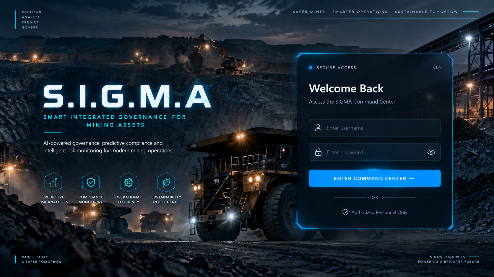

# S.I.G.M.A --- Smart Integrated Governance for Mining Assests

**AI-Powered Predictive Governance and Compliance Monitoring System for
Mining Operations**

> **Predict • Simulate • Prevent**
> 
## 🚀 SIGMA Entrance Page


## Overview

S.I.G.M.A is an AI-powered governance and compliance monitoring platform
designed for mining operations.

Traditional monitoring systems mainly report problems after they occur.
S.I.G.M.A uses historical and operational data to identify governance
risk, explain major risk drivers, simulate the effect of corrective
actions or delays, and provide actionable recommendations.

## Problem

Mining operations generate information across inspections, violations,
corrective actions, equipment maintenance, contractors, environmental
measurements, and operational activities.

When this information is fragmented or manually monitored:

-   Emerging compliance risks can be difficult to identify early.
-   High-risk issues may not receive timely attention.
-   Decision-makers may lack a clear explanation of why a mine is
    becoming risky.
-   The impact of delaying corrective actions is difficult to visualize.
-   Governance teams spend time combining information from multiple
    sources.

## Solution

S.I.G.M.A combines data management, machine learning, rule-based
intelligence, simulation, and an AI assistant into one governance
platform.

``` text
Mining Data
    ↓
Data Ingestion & Standardization
    ↓
MySQL Database
    ↓
Risk & Compliance Intelligence
    ↓
ML Risk Prediction
    ↓
Risk Drivers & Explanation
    ↓
What-If Simulation
    ↓
AI Recommendations
    ↓
Governance Decision & Action
```

## Key Features

### Predictive Risk Analytics

The machine-learning risk engine analyzes:

-   Violation count
-   Overdue corrective actions
-   Inspection score
-   Maintenance delays
-   Equipment failures
-   Contractor violations
-   Contractor compliance score
-   Environmental issues

The model classifies mine-level governance pressure into **Low, Medium,
High, and Critical** risk levels.

### Explainable Risk Analysis

S.I.G.M.A shows the major **risk drivers** behind a prediction so
management can understand what is contributing to the current risk.

### What-If Risk Simulator

The simulator compares:

-   **Current Governance Pressure**
-   **After Corrective Action**
-   **After 7-Day Delay**

This helps decision-makers understand how intervention or delay can
change the estimated risk score.

### Compliance Monitoring

Tracks:

-   Total violations
-   Open violations
-   Overdue corrective actions
-   Completed actions
-   Violation status

### Operational Intelligence

Monitors:

-   Equipment maintenance delays
-   Equipment failures
-   Equipment condition
-   Contractor violations
-   Contractor compliance scores

### Sustainability Intelligence

Analyzes:

-   Dust levels
-   Air quality
-   Water pH
-   Noise levels
-   Environmental violations

Environmental risk is evaluated using defined monitoring rules and
recommendations.

### SIGMA AI Assistant

The AI assistant provides natural-language interaction for questions
about:

-   Mine risk
-   Compliance
-   Equipment
-   Contractors
-   Environmental conditions
-   Corrective actions

The frontend also supports conversation history for previous AI
interactions.

## AI/ML Components

### Machine Learning

A **Random Forest classification model** is used for governance risk
prediction.

The trained model is stored as:

``` text
ML engine/risk_model.pkl
```

### Rule-Based Intelligence

Environmental risk uses domain-oriented thresholds for dust, air
quality, water pH, noise, and environmental violations.

### Generative AI

The SIGMA AI Assistant uses a Gemini-based integration for
natural-language governance assistance.

## Technology Stack

  Layer               Technology
  ------------------- ------------------------------
  Frontend            React + Vite
  Backend             Python + FastAPI
  Database            MySQL
  Machine Learning    Python, Pandas, Scikit-learn
  ML Model            Random Forest
  AI Assistant        Google Gemini
  API Communication   REST APIs
  Styling             CSS
  Development         VS Code

## Project Structure

``` text
SIGMA/
├── backend/
│   ├── main.py
│   ├── db.py
│   └── import_csv.py
│
├── frontend/
│   ├── index.html
│   ├── package.json
│   ├── package-lock.json
│   └── src/
│       ├── App.jsx
│       ├── App.css
│       ├── main.jsx
│       └── assets/
│
├── ML engine/
│   ├── generate_database.py
│   ├── risk_model.py
│   ├── risk_prediction.py
│   └── risk_model.pkl
│
├── mines.csv
├── inspection.csv
├── Violations.csv
├── corrective_actions.csv
├── equipment.csv
├── contractors.csv
├── environment.csv
└── training_data.csv
```

## Running Locally

### Backend

``` bash
cd Sigmabackend
python -m uvicorn main:app --host 127.0.0.1 --port 8001
```

Backend:

``` text
http://127.0.0.1:8001
```

API documentation:

``` text
http://127.0.0.1:8001/docs
```

### Frontend

``` bash
cd Sigmafrontend
npm install
npm run dev
```

Open the Vite URL shown in the terminal.

## Security

API keys, database passwords, `.env` files, and other secrets should
**never** be committed to the public repository.

Use environment variables or a secure secrets manager for deployment.

## Demo Data

The repository contains **synthetic/demo CSV data** created for
development and hackathon demonstration. These records should not be
interpreted as real-world mine measurements or regulatory records.

## Why S.I.G.M.A?

S.I.G.M.A moves governance from:

``` text
Detect → Report
```

towards:

``` text
Predict → Explain → Simulate → Act → Prevent
```

Instead of simply showing what went wrong, the platform helps
decision-makers understand **what is likely to become risky, why it is
risky, what action can reduce the risk, and what may happen if action is
delayed.**

## Future Scope

-   Real-time IoT and sensor integration
-   Mobile field-inspection application
-   GIS-based mine risk mapping
-   OCR for regulatory documents and inspection reports
-   Voice-based field reporting
-   Advanced regulatory knowledge retrieval
-   Automated compliance report generation
-   Continuous model retraining using verified historical data
-   Role-based governance workflows
-   Cloud deployment and enterprise-scale integration

## Hackathon Project

**Project:** S.I.G.M.A\
**Focus:** Predictive governance, compliance monitoring, risk
simulation, and AI-assisted decision support for mining operations.

------------------------------------------------------------------------

**S.I.G.M.A --- Predict. Simulate. Prevent.**
